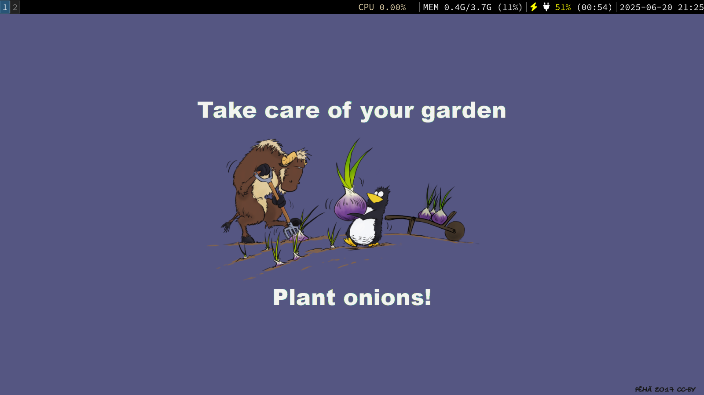

# Dotfiles

This is a really self explanatory repository, mainly built for myself to store my dotfiles as I use multiple laptops for different things and want to keep my configs up to date between the two of them.

These files are stored with `stow`, which **should** be available on most distro's package managers.
In your .xinitrc, you should have something such as `stow --dir=dotfiles/ --traget=.config/ .` if you have this repo in your home directory.

